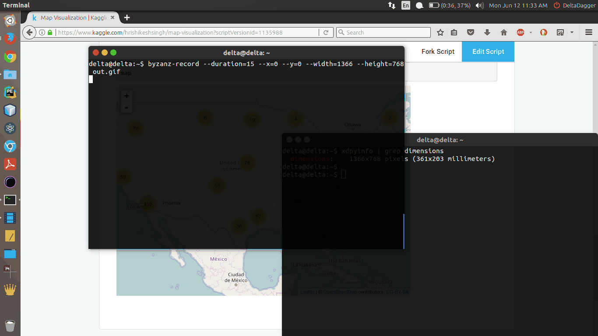

# Fortune_Predictor
A research based visualization software for Students of India to visualize future payment of the student on the basis of Debt and Average Income of Alumini of Universities of US and other features provided in dataset provided by US Dept. Of Education in 2017 using Machine Learning Models and Visualizations on Google Maps.

<h3>Demo</h3>

